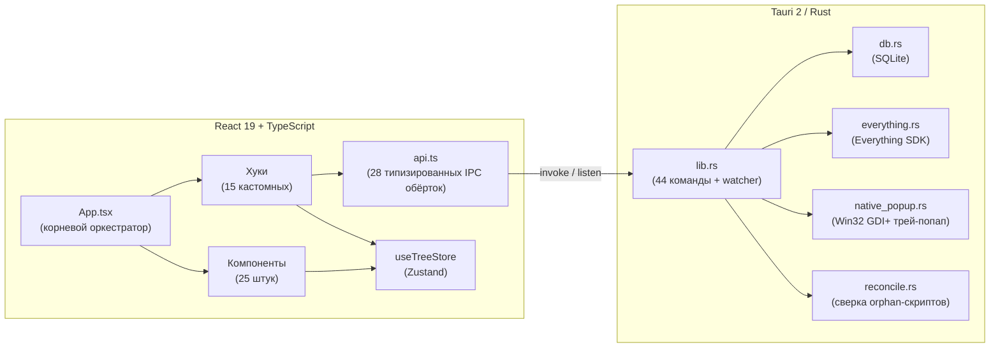
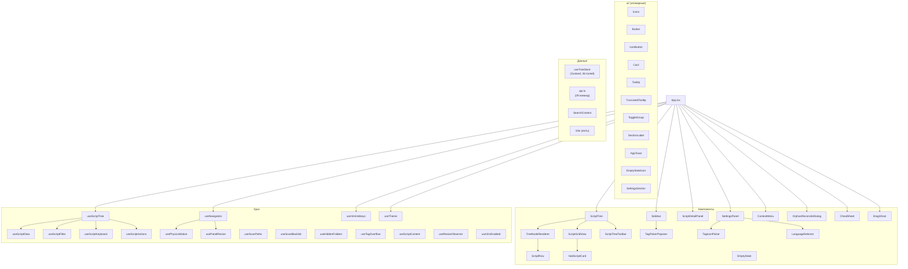
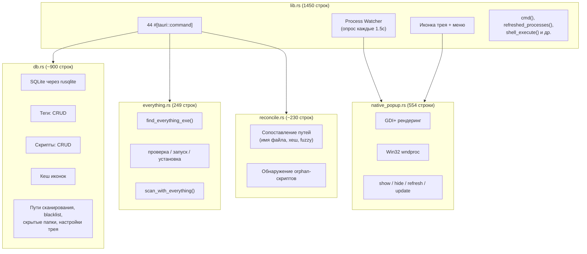

# Архитектура

## Поток данных

```mermaid
flowchart LR
    subgraph Frontend ["React 19 + TypeScript"]
        App["App.tsx\n(корневой оркестратор)"]
        API["api.ts\n(28 типизированных IPC обёрток)"]
        Store["useTreeStore\n(Zustand)"]
        Hooks["Хуки\n(15 кастомных)"]
        UI["Компоненты\n(25 штук)"]

        App --> Hooks
        App --> UI
        Hooks --> API
        Hooks --> Store
        UI --> Store
    end

    subgraph Backend ["Tauri 2 / Rust"]
        Lib["lib.rs\n(44 команды + watcher)"]
        DB["db.rs\n(SQLite)"]
        Everything["everything.rs\n(Everything SDK)"]
        Popup["native_popup.rs\n(Win32 GDI+ трей-попап)"]
        Reconcile["reconcile.rs\n(сверка orphan-скриптов)"]

        Lib --> DB
        Lib --> Everything
        Lib --> Popup
        Lib --> Reconcile
    end

    API -- "invoke / listen" --> Lib
```

## Дерево фронтенда

```mermaid
flowchart TD
    App["App.tsx"]

    subgraph Components ["Компоненты"]
        direction TB
        Sidebar["Sidebar"]
        ScriptTree["ScriptTree"]
        TreeNode["TreeNodeRenderer"]
        ScriptRow["ScriptRow"]
        HubCard["HubScriptCard"]
        GridView["ScriptGridView"]
        Toolbar["ScriptTreeToolbar"]
        Detail["ScriptDetailPanel"]
        Settings["SettingsPanel"]
        CtxMenu["ContextMenu"]
        Orphan["OrphanReconcileDialog"]
        CheatSheet["CheatSheet"]
        TagPicker["TagPickerPopover"]
        TagIcon["TagIconPicker"]
        DragGhost["DragGhost"]
        Empty["EmptyState"]
        LangSel["LanguageSelector"]
    end

    subgraph UIKit ["ui/ (атомарные)"]
        Icons & Button & IconButton & Card
        Tooltip & TruncatedTooltip
        ToggleGroup & SectionLabel
        AppToast & EmptyStateIcon
        SettingsSection
    end

    subgraph Hooks ["Хуки"]
        direction TB
        useScriptTree --> useScriptData
        useScriptTree --> useScriptFilter
        useScriptTree --> useScriptKeyboard
        useScriptTree --> useScriptActions
        useNavigation --> usePhysicsMotion
        useNavigation --> usePanelResize
        useVimHotkeys
        useTheme
        useScanPaths
        useScanBlacklist
        useHiddenFolders
        useTagOverflow
        useScriptContent
        useResizeObserver
        useVimEnabled
    end

    subgraph Data ["Данные"]
        Store["useTreeStore\n(Zustand, 36 полей)"]
        API["api.ts\n(28 команд)"]
        SearchCtx["SearchContext"]
        i18n["i18n (en/ru)"]
    end

    App --> Sidebar
    App --> ScriptTree
    App --> Detail
    App --> Settings
    App --> CtxMenu
    App --> Orphan
    App --> CheatSheet
    App --> DragGhost

    ScriptTree --> Toolbar
    ScriptTree --> TreeNode
    TreeNode --> ScriptRow
    ScriptTree --> GridView
    GridView --> HubCard

    Sidebar --> TagPicker
    Settings --> LangSel
    Settings --> TagIcon

    App --> useScriptTree
    App --> useNavigation
    App --> useVimHotkeys
    App --> useTheme
```

## Модули бэкенда

```mermaid
flowchart TD
    subgraph lib.rs ["lib.rs (1450 строк)"]
        Commands["44 #[tauri::command]"]
        Watcher["Process Watcher\n(опрос каждые 1.5с)"]
        Tray["Иконка трея + меню"]
        Helpers["cmd(), refreshed_processes(),\nshell_execute() и др."]
    end

    subgraph db.rs ["db.rs (~900 строк)"]
        SQLite["SQLite через rusqlite"]
        Tags["Теги: CRUD"]
        Scripts["Скрипты: CRUD"]
        Icons["Кеш иконок"]
        Config["Пути сканирования, blacklist,\nскрытые папки, настройки трея"]
    end

    subgraph everything.rs ["everything.rs (249 строк)"]
        Find["find_everything_exe()"]
        Status["проверка / запуск / установка"]
        Scan["scan_with_everything()"]
    end

    subgraph native_popup.rs ["native_popup.rs (554 строки)"]
        GDI["GDI+ рендеринг"]
        WndProc["Win32 wndproc"]
        PopupAPI["show / hide / refresh / update"]
    end

    subgraph reconcile.rs ["reconcile.rs (~230 строк)"]
        Match["Сопоставление путей\n(имя файла, хеш, fuzzy)"]
        Orphan["Обнаружение orphan-скриптов"]
    end

    Commands --> db.rs
    Commands --> everything.rs
    Watcher --> native_popup.rs
    Tray --> native_popup.rs
    Commands --> reconcile.rs
```
